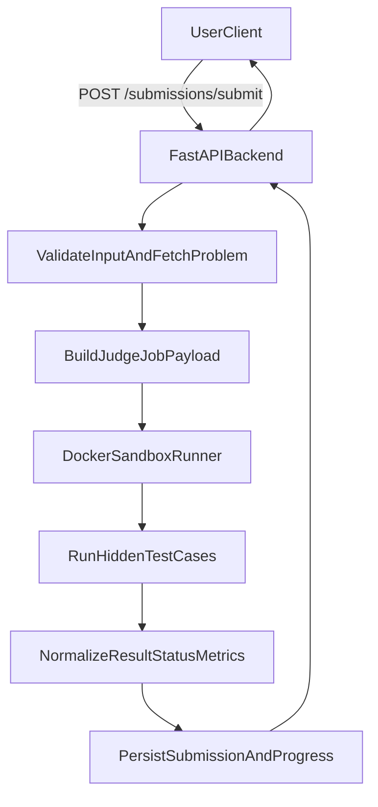

# Build Full-Stack Data Engineering Practice Platform

## Goal
Create a full-stack MVP similar to LeetCode for data engineering practice: users browse problems, solve in-browser, run and submit code against real test cases, and track progress.

## Confirmed architecture
- Frontend: `React + Vite + TypeScript + Tailwind + react-router-dom + tanstack-query + Monaco`
- Backend: `Python + FastAPI`
- Judge: synchronous local Docker sandbox execution
- Persistence: SQL database (PostgreSQL by default)
- Scope: include real auth, persistence, submission history, and real run/submit execution

## Planned project structure
- Frontend
  - `frontend/src/app/` providers, routes, layout
  - `frontend/src/features/problems/` list/filter/detail views
  - `frontend/src/features/solve/` editor, run/submit UI, output panel
  - `frontend/src/features/progress/` solved stats and streak UI
  - `frontend/src/shared/api/` typed API client
- Backend
  - `backend/app/main.py` FastAPI app bootstrap
  - `backend/app/api/` routers (`auth`, `problems`, `submissions`, `progress`)
  - `backend/app/models/` ORM models
  - `backend/app/schemas/` pydantic request/response schemas
  - `backend/app/services/judge/` Docker judge orchestration
  - `backend/app/services/auth/` JWT auth and password hashing
  - `backend/app/db/` migrations and session config
- Infra
  - `docker-compose.yml` database + app services
  - `judge-images/` runner images and execution scripts

## Core APIs and entities
- `POST /auth/signup`, `POST /auth/login`, `GET /auth/me`
- `GET /problems`, `GET /problems/{slug}`
- `POST /submissions/run` (sample tests), `POST /submissions/submit` (full tests)
- `GET /submissions/history?problemId=...`
- `GET /progress/summary`

## Judge execution flow

## Implementation sequence
1. Bootstrap monorepo folders (`frontend`, `backend`) with local env and shared README.
2. Implement backend auth, database models, migrations, and problem catalog APIs.
3. Implement Docker judge service (resource limits, timeouts, isolated filesystem/network off).
4. Implement submission endpoints (run/submit/history) and progress aggregation.
5. Implement frontend pages: problem list, detail, solve workspace, progress dashboard.
6. Wire frontend to backend with typed API hooks and auth/session handling.
7. Add integration tests for run/submit and core UI journeys.
8. Add seed data for data-engineering problems (SQL/Python), finalize local run docs.

## Acceptance criteria
- User can sign up/login and stay authenticated across refresh.
- User can browse/filter/open challenges and view statement + starter code.
- User can run code against sample tests and submit against hidden tests with real Docker execution.
- User can view submission history and updated solved/progress metrics.
- Full system runs locally with documented commands (`frontend`, `backend`, `db`, `judge`).

## Safety and platform constraints
- Judge containers run with CPU/memory/time limits and network disabled.
- Execution directory is ephemeral per run; no host mounts beyond controlled workspace.
- Request rate limits and payload size checks applied on submission endpoints.
- Language support starts with Python and SQL; extensible runner interface for Spark later.
